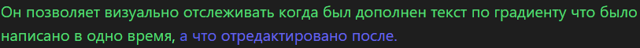

## Obsidian plugin
# Time color

## Описание

Time color - это плагин для Obsidian, который добавляет цветовые градиенты к вашему тексту в реальном времени. Он изменяет цвет текста в зависимости от активности пользователя в редакторе

## Зачем?

                     
И делает это быстро.
В частности это полезно при записывании мыслей.

Все настройки (градиент, скорость изменений в цвете, сами цвета) можно изменить в файле .js полностью подстроив его под свой стиль!
## Установка

1. Скачайте последнюю версию плагина из репозитория.
2. Распакуйте архив в папку `.obsidian/plugins/` внутри вашей рабочей области Obsidian.
3. Перезапустите Obsidian и включите плагин в настройках.

## Использование

После установки плагина, введите текст в Obsidian. Плагин автоматически изменяет цвет текста, который вы вводите, создавая красивый градиент. Так же добавляются временные данные для более четкого отслеживания создания идей.

## Контрибуция

Если вы хотите внести свой вклад в развитие этого плагина, не стесняйтесь отправлять запросы на pull.

## Лицензия

Этот проект лицензирован - подробности смотрите в файле LICENSE.md
