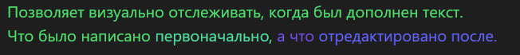

## Плагин Obsidian
# Time Color

## Описание

"Time Color" - это плагин для Obsidian, который добавляет цветовые градиенты к вашему тексту в реальном времени. Он изменяет цвет текста в зависимости от активности пользователя в редакторе.

## Применение

Плагин помогает заново перечитывать текст или отследить его создание. Особенно полезен для конспектирования мыслей.                      
Все настройки (градиент, скорость изменения цвета, сами цвета) можно настроить в файле .js, полностью подстроив его под свой стиль!

## Установка

1. Скачайте последнюю версию плагина из репозитория.
2. Распакуйте архив в папку `.obsidian/plugins/` внутри вашей рабочей области Obsidian.
3. Перезапустите Obsidian и включите плагин в настройках.

## Использование

После установки плагина, начните вводить текст в Obsidian. Плагин автоматически изменяет цвет текста, который вы вводите, создавая красивый градиент. Также добавляются временные метки для более точного отслеживания процесса создания идей.

## Вклад в развитие

Если вы хотите внести свой вклад в развитие этого плагина, не стесняйтесь отправлять запросы на pull.

## Лицензия

Этот проект лицензирован - подробности смотрите в файле LICENSE.md.
